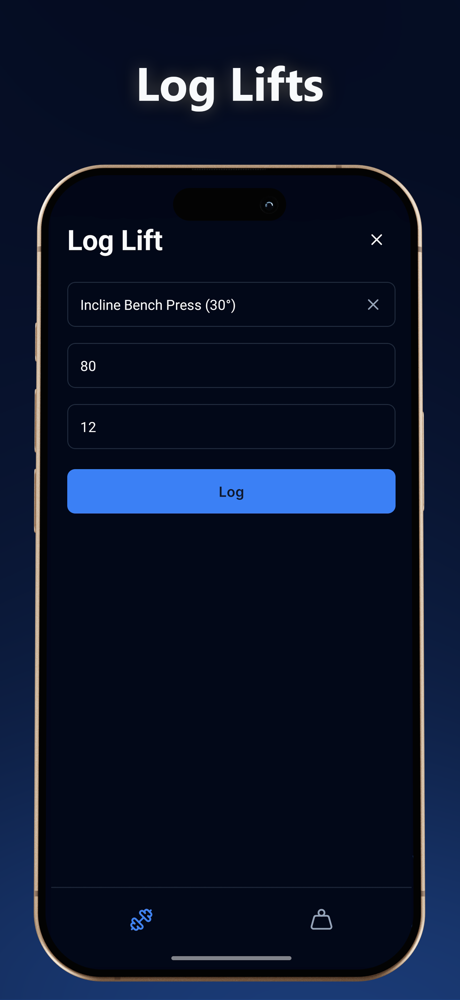
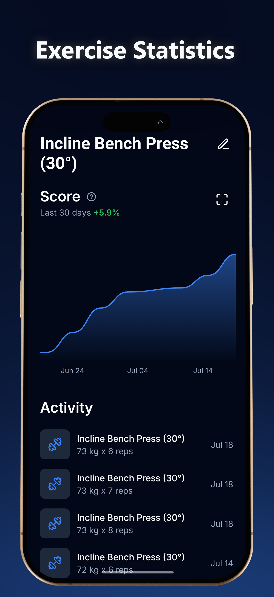
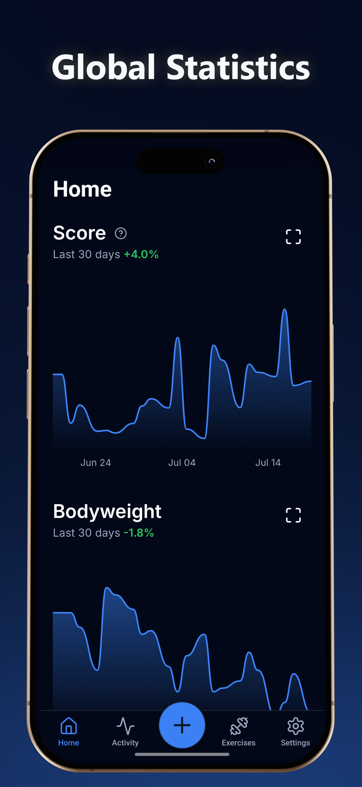
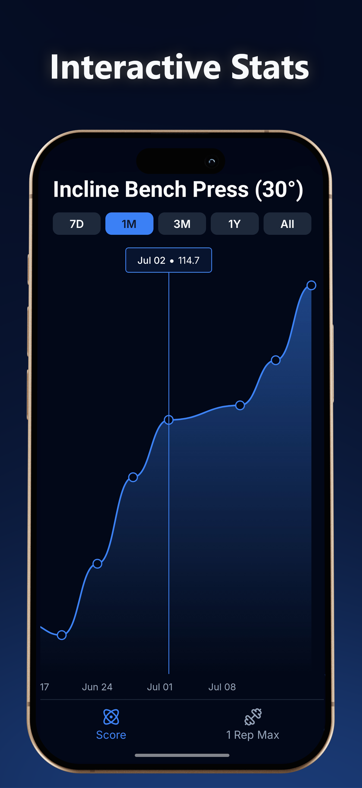

# MiniLift 🏋️‍♂️

**Just Lift.** A minimalist, privacy-focused workout tracker designed for speed. No accounts, no loading spinners, just raw performance.

  
  
  
  
  

### ⚡ Highlights
*   **Local-First Architecture:** Powered by **MMKV** for instant load times (0ms latency).
*   **Privacy Focused:** 100% offline. Your data stays on your device.
*   **Advanced Analytics:** Interactive charts to track volume and progressive overload.
*   **Haptic Feedback:** Tactile interactions for a premium feel.

### 🛠 Tech Stack

### 📲 Download the App

  
  

